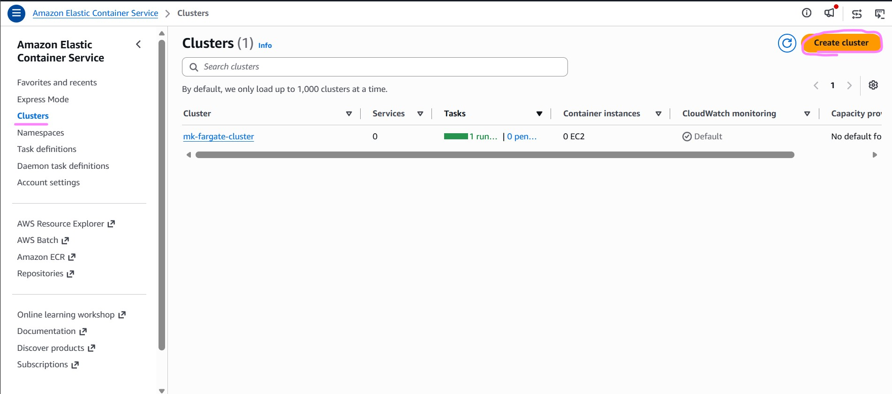
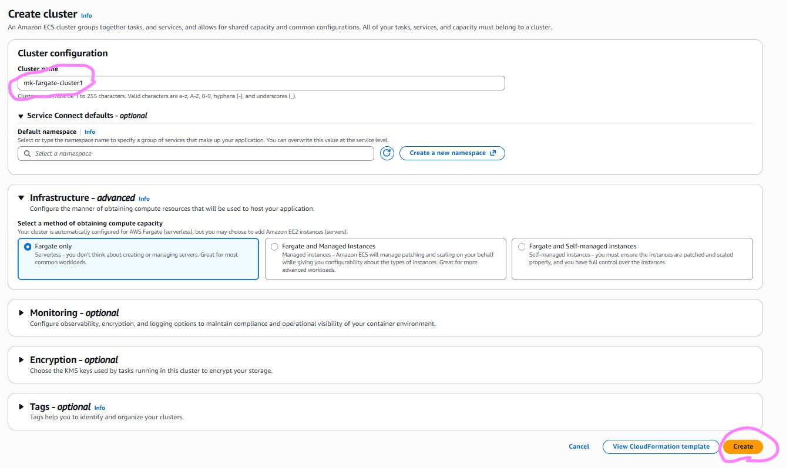
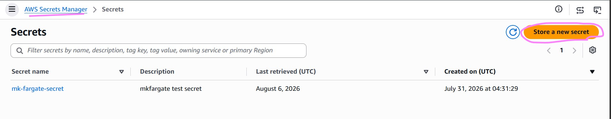
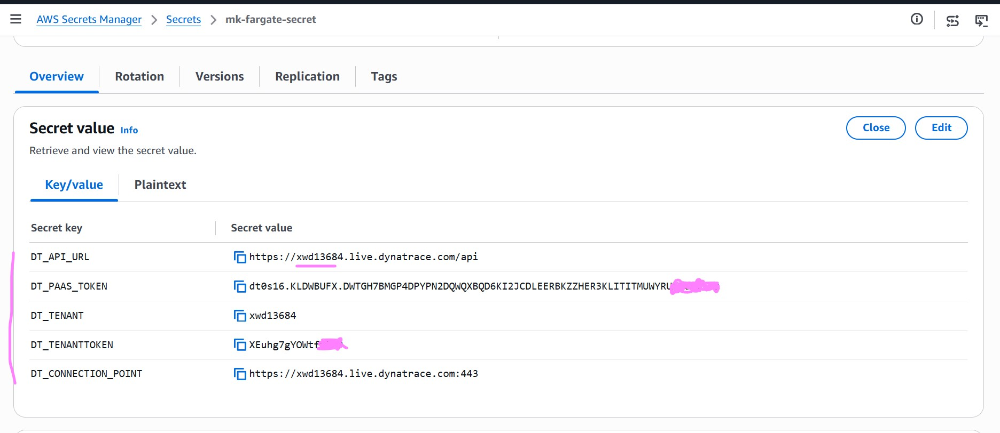
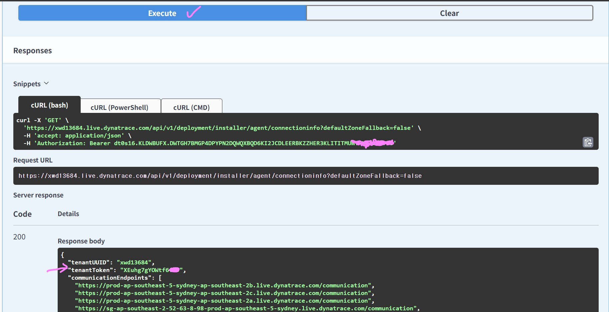

# 14_1_1 Instrumenting Amazon ECS Fargate workloads

## In this tutorial we will manually instrument Amazon ECS Fargate workloads integrating Dynatrace OneAgent code modules into your Fargate tasks using an initContainer. The initContainer copies the OneAgent artifacts into a shared ephemeral volume, where environment variables then configure and activate OneAgent.
> Amazon ECS Fargate is a serverless compute engine for Amazon ECS that lets you run containers without managing servers or EC2 clusters.

# Environment Setup

## 1) Creating an ECS cluster
- In AWS console , go to Elastic Container Service (ECS Fargate)
- Click Create cluster

- name the cluster and click Create 

## 2) Creating secret to store environment variables used for configuration
- In AWS console , go to Secret Manager service
- Click store a new secret

- Choose Other type of secret
- Add the key and values as below. Replace your with your tenant ID, platform PAAS token and tenant token.
- 

- 2.1 Below is how to create your own tokens

- 2.1.1 Create PAAS token via my https://myaccount.dynatrace.com/platformTokens  
> Refer Permissions: https://docs.dynatrace.com/docs/ingest-from/amazon-web-services/integrate-into-aws/aws-fargate

- 2.1.2 Get Tenant token via (Swagger UI) Dynatrace API > Environment API v1 > Deployment > GET /deployment/installer/agent/connectioninfo.   

> NOTE: You will need to use your platform token to authorize the API call in Swagger UI.

## 3) Creating Cloudwatch log group 
-  In AWS console , go to Cloudwatch service
- Under Logs > Log Management
- Click Create log group button and create two groups called (/ecs/oneagent and /ecs/webcontainer) as per screenshot below
> NOTE : These two log groups will be used to gather the oneagent and web container application logs to understand what is going on within the ECS container for debugging. 

