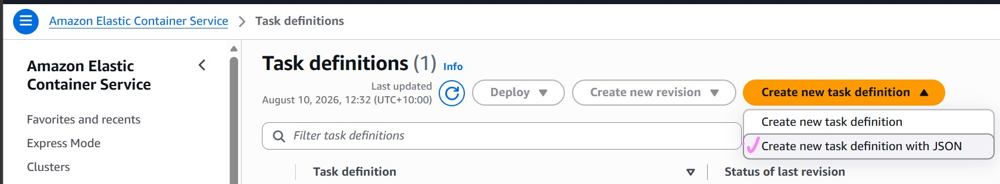

# 14_2 Instrumenting sample Nginx application with Oneagent code module for Nginx

## In this tutorial we will define a task definition. The ECS task definition configures an AWS Fargate task that runs an NGINX web server instrumented with Dynatrace OneAgent for application performance monitoring.
> It accomplishes this using the init-container pattern, where a temporary setup container prepares the monitoring files before the main web server starts.

# Creating a task definition 
> Refer https://docs.dynatrace.com/docs/shortlink/aws-fargate#configure-the-task-definition

## 1) Creating a task definition
- In AWS console , go to Elastic Container Service (ECS Fargate) > Task definition 
- Click Create new task definition button and choose Create new task definition with JSON


-  template for the sample application - you will need to modify the below template with your own values

> 1. Rename first line mk-fargate-task with your own task name. 
> 2. Replace all secrets: ARN values with your own ones from your secret manager 

> "valueFrom": "arn:aws:secretsmanager:ap-northeast-2:917226228317:secret:mk-fargate-secret-ZqKPI0:DT_API_URL::"

> "valueFrom": "arn:aws:secretsmanager:ap-northeast-2:917226228317:secret:mk-fargate-secret-ZqKPI0:DT_PAAS_TOKEN::"

> "valueFrom": "arn:aws:secretsmanager:ap-northeast-2:917226228317:secret:mk-fargate-secret-ZqKPI0:DT_TENANT::"

> "valueFrom": "arn:aws:secretsmanager:ap-northeast-2:917226228317:secret:mk-fargate-secret-ZqKPI0:DT_TENANTTOKEN::"

> "valueFrom": "arn:aws:secretsmanager:ap-northeast-2:917226228317:secret:mk-fargate-secret-ZqKPI0:DT_CONNECTION_POINT::"

> 3. Under /ecs/oneagent , Replace "awslogs-region": "ap-northeast-2" with your own Cloudwatch region
> 4. Under /ecs/webcontainer , Replace "awslogs-region": "ap-northeast-2" with your own Cloudwatch region

```
{
    "family": "mk-fargate-task",
    "containerDefinitions": [
        {
            "name": "initoneagent",
            "image": "public.ecr.aws/dynatrace/dynatrace-codemodules:1.329.62.20260107-143121-nginx",
            "cpu": 0,
            "portMappings": [],
            "essential": false,
            "command": [
                "--source=/opt/dynatrace/oneagent",
                "--target=/mnt/dynatrace/oneagent",
                "--technology=nginx"
            ],
            "environment": [
                {
                    "name": "DT_ONEAGENT_OPTIONS",
                    "value": "flavor=default&include=all"
                }
            ],
            "mountPoints": [
                {
                    "sourceVolume": "oneagent",
                    "containerPath": "/mnt",
                    "readOnly": false
                }
            ],
            "volumesFrom": [],
            "secrets": [
                {
                    "name": "DT_API_URL",
                    "valueFrom": "arn:aws:secretsmanager:ap-northeast-2:917226228317:secret:mk-fargate-secret-ZqKPI0:DT_API_URL::"
                },
                {
                    "name": "DT_PAAS_TOKEN",
                    "valueFrom": "arn:aws:secretsmanager:ap-northeast-2:917226228317:secret:mk-fargate-secret-ZqKPI0:DT_PAAS_TOKEN::"
                }
            ],
            "user": "0:0",
            "logConfiguration": {
                "logDriver": "awslogs",
                "options": {
                    "awslogs-group": "/ecs/oneagent",
                    "awslogs-region": "ap-northeast-2",
                    "awslogs-stream-prefix": "ecs"
                }
            },
            "systemControls": []
        },
        {
            "name": "webcontainer",
            "image": "public.ecr.aws/nginx/nginx:1.25.2-alpine-slim",
            "cpu": 0,
            "portMappings": [],
            "essential": true,
            "environment": [
                {
                    "name": "LD_PRELOAD",
                    "value": "/mnt/dynatrace/oneagent/agent/lib64/liboneagentproc.so"
                },
                {
                    "name": "DT_LOGSTREAM",
                    "value": "stdout"
                },
                {
                    "name": "DT_LOGLEVELCON",
                    "value": "INFO"
                }
            ],
            "mountPoints": [
                {
                    "sourceVolume": "oneagent",
                    "containerPath": "/mnt",
                    "readOnly": false
                }
            ],
            "volumesFrom": [],
            "linuxParameters": {
                "initProcessEnabled": true
            },
            "secrets": [
                {
                    "name": "DT_TENANT",
                    "valueFrom": "arn:aws:secretsmanager:ap-northeast-2:917226228317:secret:mk-fargate-secret-ZqKPI0:DT_TENANT::"
                },
                {
                    "name": "DT_TENANTTOKEN",
                    "valueFrom": "arn:aws:secretsmanager:ap-northeast-2:917226228317:secret:mk-fargate-secret-ZqKPI0:DT_TENANTTOKEN::"
                },
                {
                    "name": "DT_CONNECTION_POINT",
                    "valueFrom": "arn:aws:secretsmanager:ap-northeast-2:917226228317:secret:mk-fargate-secret-ZqKPI0:DT_CONNECTION_POINT::"
                }
            ],
            "dependsOn": [
                {
                    "containerName": "initoneagent",
                    "condition": "COMPLETE"
                }
            ],
            "logConfiguration": {
                "logDriver": "awslogs",
                "options": {
                    "awslogs-group": "/ecs/webcontainer",
                    "awslogs-region": "ap-northeast-2",
                    "awslogs-stream-prefix": "ecs"
                }
            },
            "systemControls": []
        }
    ],
    "executionRoleArn": "arn:aws:iam::917226228317:role/ecsTaskExecutionRole",
    "networkMode": "awsvpc",
    "volumes": [
        {
            "name": "oneagent",
            "host": {}
        }
    ],
    "placementConstraints": [],
    "requiresCompatibilities": [
        "FARGATE"
    ],
    "cpu": "256",
    "memory": "512"
}
```
